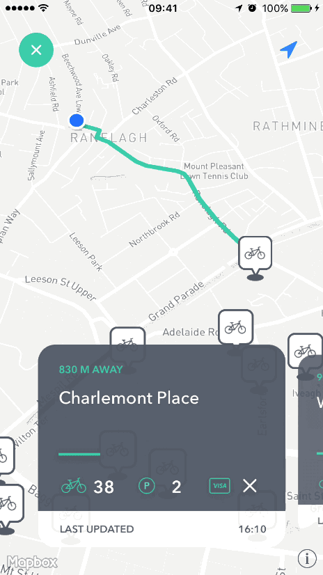

# ScalingCarousel

[](https://travis-ci.org/superpeteblaze/ScalingCarousel)
[](http://cocoapods.org/pods/ScalingCarousel)
[](http://cocoapods.org/pods/ScalingCarousel)
[](http://cocoapods.org/pods/ScalingCarousel)
[](https://github.com/Carthage/Carthage)
[](https://github.com/apple/swift-package-manager)

ScalingCarousel provides a simple carousel-style collection view.
It takes care of cell presentation, scaling each cell as the collection view is scrolled.

It is used in [Bikey](https://itunes.apple.com/ie/app/bikey/id1048962300?mt=8) to present bike station information, as seen below;



## Usage

ScalingCarousel can be added via both storyboard/xib and code, as described below.

### Storyboard

* Add a UICollectionView to your view, and change the type to ScalingCarouselView

* In the attributes inspector, set the desired carousel inset

* Set your UIViewController as the collection view datasource and implement the standard UICollectionViewDatasource methods in your view controller

* Set your UIViewController as the collection view delegate and implement the UIScrollViewDelegate method scrollViewDidScroll(:). In this method, call the didScroll() method of ScalingCarouselView

* Create a custom UICollectionViewCell which inherits from ScalingCarouselCell, and set the cell type to your custom cell type in the storyboard

* Add a view to the cell's content view, and connect this via the Connections Inspector (in Interface builder) to the cell's mainView IBOutlet.
This property is declared in ScalingCarouselCell. You should add any cell content to this view.

* Note: To ensure correct scaling of the ScalingCarouselCell, you need to call the following code after you configure your cell with it's data (e.g in `cellForItem(at:)`):

```swift
cell.setNeedsLayout()
cell.layoutIfNeeded()
```
* Note: To ensure correct displayed of the ScalingCarousel, you need to call the following code in the method  `viewWillTransition(to size:, with coordinator:)` of the ViewController:

```swift
super.viewWillTransition(to: size, with: coordinator)
scalingCarousel.deviceRotated()
```

### Code

* Create a custom UICollectionViewCell which inherits from ScalingCarouselCell. Initialize the mainView property, which is declared in ScalingCarouselCell;

```swift
override init(frame: CGRect) {
  super.init(frame: frame)

  // Initialize the mainView property and add it to the cell's contentView
  mainView = UIView(frame: contentView.bounds)
  contentView.addSubview(mainView)
  mainView.translatesAutoresizingMaskIntoConstraints = false
  NSLayoutConstraint.activate([
      mainView.leadingAnchor.constraint(equalTo: contentView.leadingAnchor),
      mainView.trailingAnchor.constraint(equalTo: contentView.trailingAnchor),
      mainView.topAnchor.constraint(equalTo: contentView.topAnchor),
      mainView.bottomAnchor.constraint(equalTo: contentView.bottomAnchor)
  ])
}
```

* Create and add a ScalingCarouselView to your view, and implement the standard UICollectionViewDatasource methods in your view controller;

```swift
// Create our carousel
let scalingCarousel = ScalingCarouselView(withFrame: frame, andInset: 20)
scalingCarousel.dataSource = self
scalingCarousel.delegate = self
scalingCarousel.translatesAutoresizingMaskIntoConstraints = false

// Register our custom cell for dequeueing
scalingCarousel.register(Cell.self, forCellWithReuseIdentifier: "cell")

// Add our carousel as a subview        
view.addSubview(scalingCarousel)

// Add Constraints
scalingCarousel.widthAnchor.constraint(equalTo: view.widthAnchor, multiplier: 1).isActive = true
scalingCarousel.heightAnchor.constraint(equalToConstant: 300).isActive = true
scalingCarousel.leadingAnchor.constraint(equalTo: view.leadingAnchor).isActive = true
scalingCarousel.topAnchor.constraint(equalTo: view.topAnchor, constant: 50).isActive = true
```

* Set your UIViewController as the collection view delegate and implement the UIScrollViewDelegate method scrollViewDidScroll(:). In this method, call the didScroll() method of ScalingCarouselView

* Note: To ensure correct scaling of the ScalingCarouselCell, you need to call the following code after you configure your cell with it's data (e.g in `cellForItem(at:)`):

```swift
cell.setNeedsLayout()
cell.layoutIfNeeded()
```
* Note: To ensure correct displayed of the ScalingCarousel, you need to call the following code in the method  `viewWillTransition(to size:, with coordinator:)` of the ViewController, If you have created the ScalingCarousel by code in the viewDidLoad, It is important to verify that it exists when the method `viewWillTransition` is called or we will have a crash if we load the viewController with the device in landscape mode:

```swift
super.viewWillTransition(to: size, with: coordinator)
if scalingCarousel != nil {
    scalingCarousel.deviceRotated()
}

```

## Example

To run the example project, clone the repo, and run `pod install` from the Example directory first.

## Requirements

iOS 10

## Installation

ScalingCarousel is available through [CocoaPods](http://cocoapods.org), [Carthage](https://github.com/Carthage/Carthage) and [Swift Package Manager](https://swift.org/package-manager/).

To install via Cocoapods, add the following line to your Podfile:

```ruby
pod "ScalingCarousel"
```

To install via Carthage, add the following line to your Podfile:

```
github "superpeteblaze/ScalingCarousel"
```

To install via Swift package manager:

> Note: Instructions below are for using **SwiftPM** without the Xcode UI. It's the easiest to go to your Project Settings -> Swift Packages and add ScalingCarousel from there.

To integrate using Apple's Swift package manager, without Xcode integration, add the following as a dependency to your `Package.swift`:

```swift
.package(url: "https://github.com/superpeteblaze/ScalingCarousel.git", .upToNextMajor(from: "3.2.0"))
```
## Author

Pete Smith, peadar81@gmail.com

## License

ScalingCarousel is available under the MIT license. See the LICENSE file for more info.
